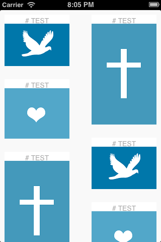

# WaterfallCollectionViewLayout

A Xamarin.iOS library for creating waterfall-styled UICollectionViewLayouts, similar to the one seen both on the Pinterest website and mobile app suite). It is based on the Objective-C version [UIWaterfallCollectionViewLayout](https://github.com/chiahsien/UICollectionViewWaterfallLayout), by Nelson. There is both a binding, as well as a feature-complete C# version, although moving forward all releases will be centered around the C# version.

Coming Soon: A component for the [Xamarin Component Store](http://components.xamarin.com).



## Getting Started
In order to get up and running with WaterfallCollectionViewLayout, you must have minimal knowledge of working with UICollectionViews. If you have never worked with UICollectionViews, they are very similar in implementation to a UITableView, with a view different marks. I would recommend stepping through the [Introduction to Collection Views](http://docs.xamarin.com/guides/ios/user_interface/introduction_to_collection_views) document from Xamarin.

### Download & Installation

1. Download the [latest release](https://github.com/pierceboggan/WaterfallCollectionViewLayout/releases) package.
2. Reference WaterfallCollectionViewLayout.dll in your Xamarin.iOS project in Xamarin Studio by right-clicking "References", followed by "Add References". Navigate to the location of the recently-downloaded package and reference the .dll.
3. Add "using WaterfallCollectionViewLayout;" to the top of the file you are wishing to use WaterfallCollectionViewLayout in.

#### Optional
At this point, you may want to step through the sample project provided with the release, or read up on some further documentation on the wiki. As mentioned earlier, experience with UICollectionViews is required to move forward, so you may want to review the basics of those as well.

Before continuing on, you will need to setup a UICollectionViewController, as well as a UICollectionViewCell.

### PCollectionViewBWaterfallDelegate
1. Create a delegate class that is a child (or subclass) of PCollectionViewBWaterfallDelegate.
2. Override the HeightForCell delegate method.
3. Return the height of a cell.
3a. Calculate the height of the cell within the HeightForCell method.
3b. Return a value from a previously-calculated list of heights.

### PBCollectionViewWaterfallLayout
1. Set the ColumnCount property.
2. Set the ItemWidth property.
3. Set the Delegate property to the previously configured child class of PCollectionViewBWaterfallDelegate.
4. Set the SectionInset property.

### UICollectionViewController

Example:
```
private void UpdateLayout ()
{
	var layout = (PBCollectionViewWaterfallLayout)CollectionView.CollectionViewLayout;
	layout.ColumnCount = (int)(CollectionView.Bounds.Size.Width / Constants.CellWidth);
	layout.ItemWidth = 140;
}
```
1. Add a method where layout recalculations can take place.
2. Call the method in ViewDidAppear and other methods when view-related changes appear (data source updated, oreientation changed).

You should now have a fully-functional waterfall UICollectionView. Check out the sample project for example implementation-level details.

## Documentation

### PCollectionViewBWaterfallDelegate
#### HeightForCell
Returns the height of the cell that can be calculated using a number of ways. One way is to call a helper method that calculates the height of the cell within HeightForCell. Another way, the preferred way, is to pre-calculate this and return the height from a List<T>.

### PBCollectionViewWaterfallLayout
#### ColumnCount
The number of columns of the waterfall UICollectionView. The default is 2.

#### Delegate
A subclass of PCollectionViewBWaterfallDelegate that overrides HeightForCell.

#### ItemWidth
The width of each cell. This is a fixed value (heights are dynamic).

#### SectionInset
Adds padding to the top, bottom, left, and right of the UICollectionView.

## Sample Project
When first starting out, it may be helpful to walkthrough the sample project provided with releases. Start in the AppDelegate.cs file, and move towards the WaterfallDelegate.cs. After that, look at the individual methods of the WaterfallCollectionViewController.

Some of the practices found in the sample may not be best-case, but they are intended to be implemented in a way that makes the sample as simple as possible.

## Limitations
* Only one section is supported
* Only vertical scrolling is supported
* No supplementary views or decoration views are supported

If you think you can remove one of these restrictions, feel free to hack on the library and see what you can do!

## Contributing
All contributions are welcome! Whether you are a seasoned programmer, or just getting your start, you can help out. You don't have to be a programming superhero to improve the project! Check out the list of things below that generally need to be done, and contribute as you will!

* File issues: Please be as descriptive as possible! If someone else has filed a bug, try to reproduce the issue and provide as much information as possible, including version numbers, test cases, and any other helpful information.
* Troll the [Xamarin Forums](http://forums.xamarin.com/): If issues relating to WaterfallCollectionViewLayout appear, you may want to hop in and help out! If people are experiencing issues, feel free to file a bug.
* Update documentation: If things change, feel free to update the README or any of the supporting documentation for the project, add wiki pages, or create more samples!
* Update samples: Samples fall in and out of date, so sometimes they will needed updating. Additionally, sometimes the current way things are written *work* but are not *ideal*. 
* Create samples: If you feel like the current demo project isn't doing the project justice, feel free to create your own demo and submit it as a pull request.
* Fix bugs: Just as we need help filing bugs, we need help fixing the same bugs. Be sure to comment on the issue and let people know you are working on a fix!
* Add new features: New features are always welcome. Especially removing some of the limitations of the layout.
* Improve performance: The current performance isn't bad, but it could be better. If you are an optimization junkie, this may be for you!

Remember, no matter what you do, feel free to help out! Getting involved in open-source was one of the best things that ever happened to my coding ability.

## License
Continuing on from the original project and Nelson's lead, this project's license type is [MIT](http://en.wikipedia.org/wiki/MIT_License). You can find the License.md file in the main repository folder.
